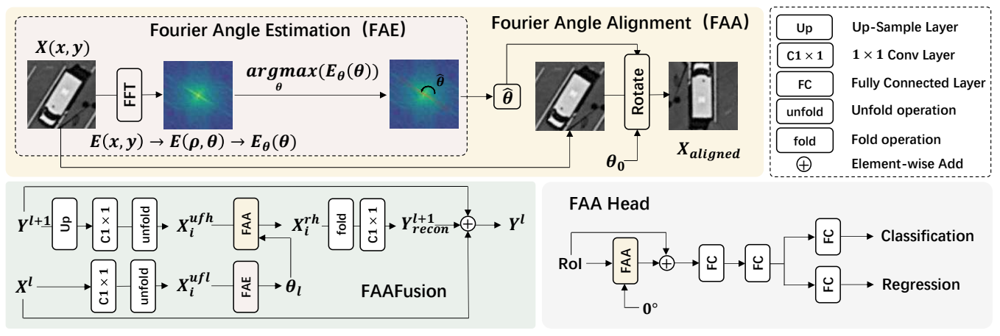

# Fourier Angle Alignment
**[CVPR 2026]** Official implementation of *Fourier Angle Alignment for Oriented Object Detection in Remote Sensing*

The paper is available at [arxiv](https://arxiv.org/abs/2602.23790).

## 📰 Abstract
In remote sensing rotated object detection, mainstream methods suffer from two bottlenecks, directional incoherence at detector neck and task conflict at detecting head. Ulitising fourier rotation equivariance, we introduce **Fourier Angle Alignment**, which analyses angle information through frequency spectrum and aligns the main direction to a certain orientation. Then we propose two plug and play modules : **FAAFusion** and **FAA Head**. FAAFusion works at the detector neck, aligning the main direction of higher-level features to the lower-level features and then fusing them. FAA Head serves as a new detection head, which pre-aligns RoI features to a canonical angle and adds them to the original features before classification and regression. Experiments on DOTA-v1.0, DOTA-v1.5 and HRSC2016 show that our method can greatly improve previous work. Particularly, our method achieves new state-of-the-art results of 78.72% mAP on DOTA-v1.0 and 72.28% mAP on DOTA-v1.5 datasets with single scale training and testing, validating the efficacy of our approach in remote sensing object detection.



## 🛠️ Installation

MMRotate depends on [PyTorch](https://pytorch.org/), [MMCV](https://github.com/open-mmlab/mmcv) and [MMDetection](https://github.com/open-mmlab/mmdetection).
Below are quick steps for installation.
Please refer to [Install Guide](https://mmrotate.readthedocs.io/en/latest/install.html) for more detailed instruction.

```shell
conda create --name faa python=3.9 -y
conda activate faa
pip install torch==1.13.0+cu116 torchvision==0.14.0+cu116 torchaudio==0.13.0 --extra-index-url https://download.pytorch.org/whl/cu116
pip install -U openmim
mim install mmcv-full
mim install mmdet
git clone https://github.com/gcy0423/Fourier-Angle-Alignment.git
cd Fourier-Angle-Alignment
pip install -v -e .
pip install -r requirements.txt
```

## 🚀 Results and Configs

Here we provide the configuration files for FAA applied to different baseline detectors.

### DOTA-v1.0
| Model |      mAP      | Angle | lr schd | Config |
| :--- |:-------------:| :---: | :---: | :--- |
| Oriented R-CNN + FAA | 76.55 (+0.68) | le90 | 1x | [config](./configs/faa/oriented_rcnn_r50_fpn_1x_dota_le90_faa.py) |
| LSKNet-S + FAA | 78.49 (+1.00) | le90 | 1x | [config](./configs/faa/lsk_s_fpn_1x_dota_le90_faa.py) |
| Strip R-CNN-S + FAA | 78.72 (+0.63) | le90 | 1x | [config](./configs/faa/strip_rcnn_s_fpn_1x_dota_le90_faa.py) |

### DOTA-v1.5
| Model |      mAP      | Angle | lr schd | Config |
| :--- |:-------------:| :---: | :---: | :--- |
| Oriented R-CNN + FAA | 67.14 (+0.37) | le90 | 1x | [config](./configs/faa/oriented_rcnn_r50_fpn_1x_dota15_le90_faa.py) |
| LSKNet-S + FAA | 72.28 (+2.02) | le90 | 1x | [config](./configs/faa/lsk_s_fpn_1x_dota15_le90_faa.py) |
| Strip R-CNN-S + FAA | 71.57 (+1.73) | le90 | 1x | [config](./configs/faa/strip_rcnn_s_fpn_1x_dota15_le90_faa.py) |

### HRSC2016
| Model |    mAP(07)    |    mAP(12)    | Angle | lr schd | Config |
| :--- |:-------------:|:-------------:| :---: | :---: | :--- |
| Oriented R-CNN + FAA | 66.94 (+2.17) | 69.52 (+1.72) | le90 | 3x | [config](./configs/faa/oriented_rcnn_r50_fpn_3x_hrsc_le90_faa.py) |
| LSKNet-S + FAA | 70.74 (+1.96) | 74.71 (+2.34) | le90 | 3x | [config](./configs/faa/lsk_s_fpn_3x_hrsc_le90_faa.py) |
| Strip R-CNN-S + FAA | 70.41 (+1.23) | 72.99 (+0.43) | le90 | 3x | [config](./configs/faa/strip_rcnn_s_fpn_3x_hrsc_le90_faa.py) |

### FAA Head Only (DOTA-v1.0)

Specifically, we also provide the configurations that only apply the FAA Head.

| Model |      mAP      | Angle | lr schd | Config | Download |
| :--- |:-------------:| :---: | :---: | :--- | :---: |
| Oriented R-CNN + FAA Head | 76.18 (+0.31) | le90 | 1x | [config](./configs/faa/oriented_rcnn_r50_fpn_1x_dota_le90_faahead.py) | - |
| LSKNet-S + FAA Head | 78.27 (+0.78) | le90 | 1x | [config](./configs/faa/lsk_s_fpn_1x_dota_le90_faahead.py) | [checkpoint](https://pan.baidu.com/s/1VuMQcn33I8SMY9oMDfZ4hg?pwd=vmk3) |
| Strip R-CNN-S + FAA Head | 78.52 (+0.43) | le90 | 1x | [config](./configs/faa/strip_rcnn_s_fpn_1x_dota_le90_faahead.py) | - |

## 📖 Citation

If you find this work useful for your research, please consider citing our paper:

```
@InProceedings{gcy2026faa,
  title={Fourier Angle Alignment for Oriented Object Detection in Remote Sensing},
  author={Gu, Changyu and Chen, Linwei and Gu, Lin and Fu, Ying},
  booktitle={IEEE/CVF Conference on Computer Vision and Pattern Recognition},
  year={2026}
}
```

## 💖 Acknowledgement

This project is based on [MMRotate](https://github.com/open-mmlab/mmrotate) and [LSKNet](https://github.com/cabshare/LSKNet). We thank the authors for their wonderful open-source efforts.
